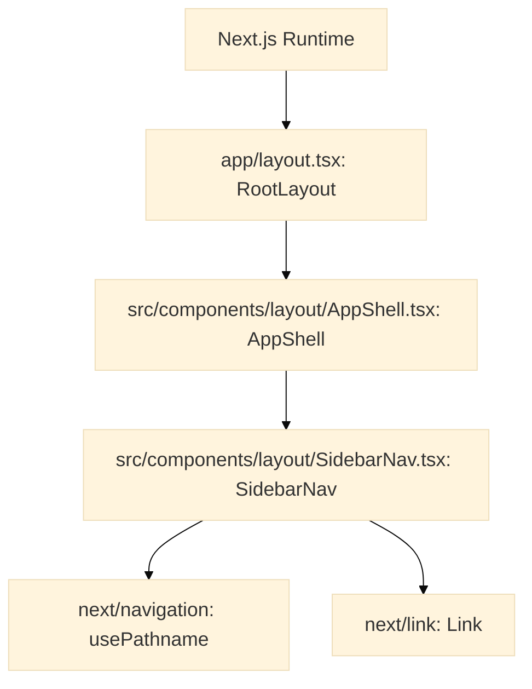
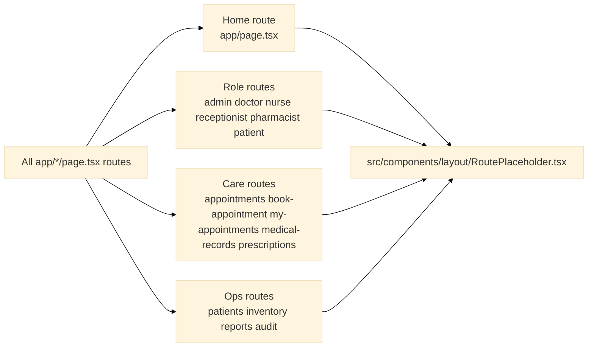
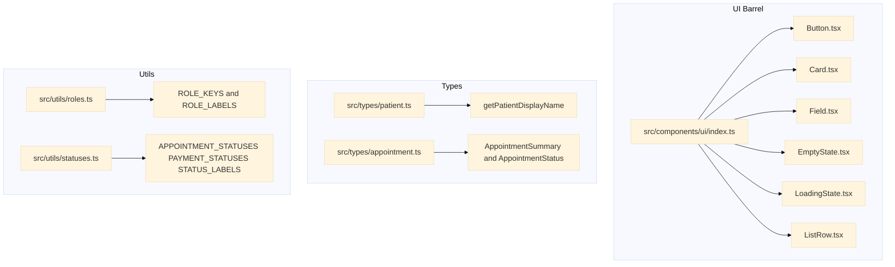

# Frontend Code Call Flow

## Scope
- Snapshot date: 2026-04-11
- Source scanned: frontend/app and frontend/src
- Goal: show which function in which file calls or depends on which file/function.

## Function Call Matrix

| File | Function / Export | Calls / Uses | Target File |
|---|---|---|---|
| app/layout.tsx | RootLayout | renders AppShell and route children | src/components/layout/AppShell.tsx |
| app/page.tsx | HomePage | renders RoutePlaceholder | src/components/layout/RoutePlaceholder.tsx |
| app/admin/page.tsx | Page | renders RoutePlaceholder | src/components/layout/RoutePlaceholder.tsx |
| app/appointments/page.tsx | Page | renders RoutePlaceholder | src/components/layout/RoutePlaceholder.tsx |
| app/audit/page.tsx | Page | renders RoutePlaceholder | src/components/layout/RoutePlaceholder.tsx |
| app/book-appointment/page.tsx | Page | renders RoutePlaceholder | src/components/layout/RoutePlaceholder.tsx |
| app/doctor/page.tsx | Page | renders RoutePlaceholder | src/components/layout/RoutePlaceholder.tsx |
| app/inventory/page.tsx | Page | renders RoutePlaceholder | src/components/layout/RoutePlaceholder.tsx |
| app/medical-records/page.tsx | Page | renders RoutePlaceholder | src/components/layout/RoutePlaceholder.tsx |
| app/my-appointments/page.tsx | Page | renders RoutePlaceholder | src/components/layout/RoutePlaceholder.tsx |
| app/nurse/page.tsx | Page | renders RoutePlaceholder | src/components/layout/RoutePlaceholder.tsx |
| app/patient/page.tsx | Page | renders RoutePlaceholder | src/components/layout/RoutePlaceholder.tsx |
| app/patients/page.tsx | Page | renders RoutePlaceholder | src/components/layout/RoutePlaceholder.tsx |
| app/pharmacist/page.tsx | Page | renders RoutePlaceholder | src/components/layout/RoutePlaceholder.tsx |
| app/prescriptions/page.tsx | Page | renders RoutePlaceholder | src/components/layout/RoutePlaceholder.tsx |
| app/receptionist/page.tsx | Page | renders RoutePlaceholder | src/components/layout/RoutePlaceholder.tsx |
| app/reports/page.tsx | Page | renders RoutePlaceholder | src/components/layout/RoutePlaceholder.tsx |
| src/components/layout/AppShell.tsx | AppShell | uses useState; renders SidebarNav and children | src/components/layout/SidebarNav.tsx |
| src/components/layout/SidebarNav.tsx | SidebarNav | uses usePathname; maps NAV_ITEMS; renders Link list | next/navigation, next/link |
| src/components/layout/RoutePlaceholder.tsx | RoutePlaceholder | renders title + description block | internal only |
| src/components/ui/Button.tsx | Button | resolves variant styles and renders button | internal only |
| src/components/ui/Card.tsx | Card | renders section container | internal only |
| src/components/ui/Field.tsx | Field, TextInput | renders form field wrapper and input | internal only |
| src/components/ui/EmptyState.tsx | EmptyState | renders empty state block | internal only |
| src/components/ui/LoadingState.tsx | LoadingState | renders loading block | internal only |
| src/components/ui/ListRow.tsx | ListRow | renders list row block | internal only |
| src/components/ui/index.ts | barrel exports | re-exports UI components | src/components/ui/* |
| src/types/patient.ts | getPatientDisplayName | computes full display name | internal only |
| src/types/appointment.ts | type exports | shape declarations only | internal only |
| src/utils/roles.ts | constants exports | role keys and labels | internal only |
| src/utils/statuses.ts | constants exports | status constants and labels | internal only |

## Readability Notes
- Diagrams were split into smaller blocks to avoid tiny text and visual overload.
- Mermaid config below increases font size and node spacing.
- If still small in your editor, open Markdown preview and zoom browser/editor to 125% to 150%.

## Runtime Flow A: Boot and Shell

## Runtime Flow B: Route Group Mapping

## Static Dependency Flow: Shared Modules

## Notes
- Current route pages are scaffolds, so they all call the same RoutePlaceholder.
- Shared UI and type modules are prepared for next issues and are mostly not consumed by route pages yet.
- When Issue 3+ is implemented, this flow should be updated because pages will start calling service/store/form modules directly.
